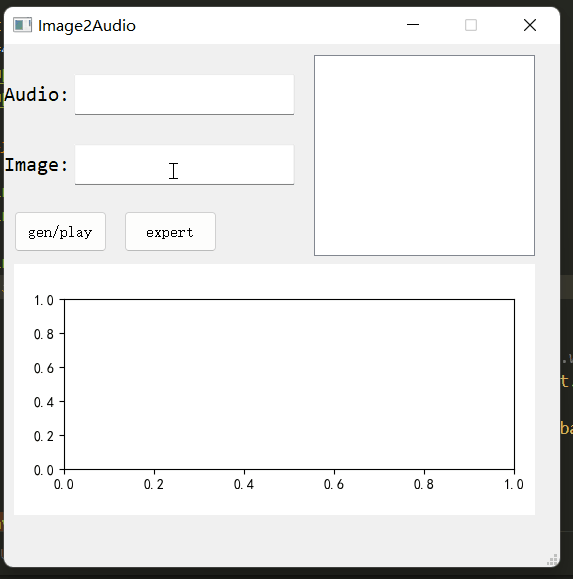
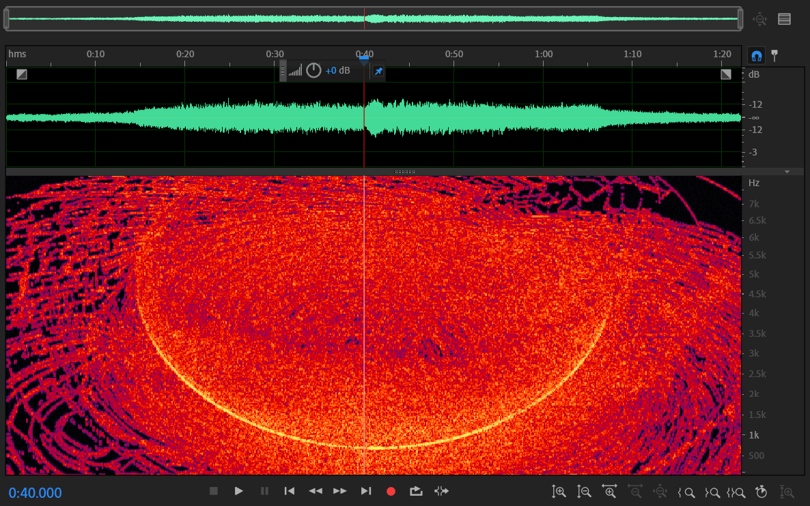

# convert Image to Audio

**Generate an audio segment from a picture that has the same spectrogram as the picture**

The operation is shown in the following figure:

open the generated audio with Adobe Audition or other audio software,you can see this:
  

You can enter an image in jpg or png format in the second input box,and then press the button <kbd>gen/play</kbd>.An audio based on the picture will be generated and played.The audio will be saved as 'output.wav' if you pressed <kbd>expert</kbd>.

If you enter an audio path in the fist input box,the **phase spectrum** of the audio will be applied in the generated audio.This is useful because you can hear something in the generated audio that exists in reference audio.

get more info: [https://shuai-xv.github.io/picture_to_audio/](https://shuai-xv.github.io/picture_to_audio/)